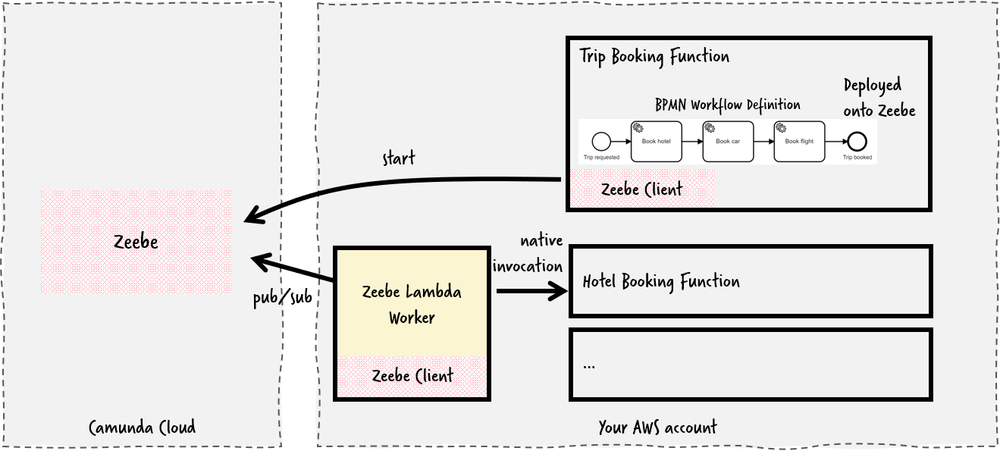
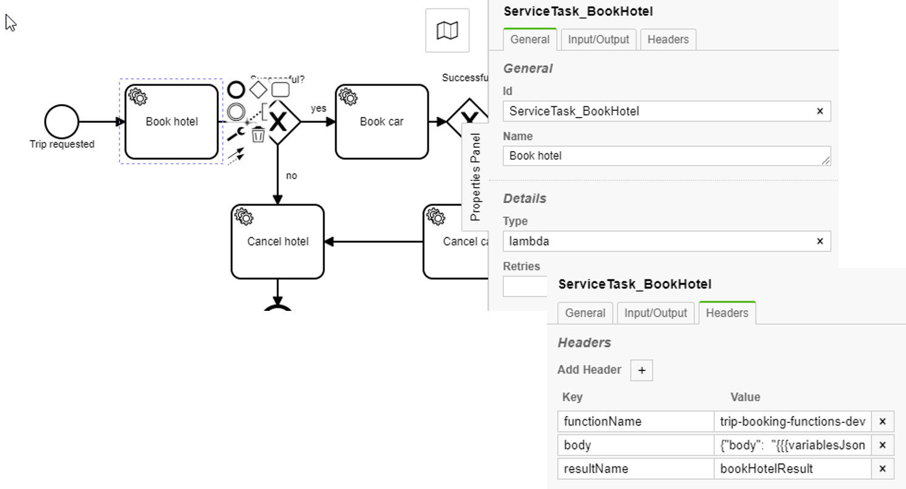

[](https://github.com/camunda-community-hub/community)
[](https://github.com/Camunda-Community-Hub/community/blob/main/extension-lifecycle.md#proof-of-concept-)

# zeebe-lambda-connector

A Zeebe connector to invoke AWS Lambdas (Serverless functions), allowing to orchestrate functions. It uses the AWS SDK to connect to Lambda.

> Requirements: Java 11

**Important Note:** This is a community extension and does not give you any guarantees. In fact, it was developed as part of a POC and might not be ready for production usage yet.



# Usage

## BPMN Service Task

Example service task in BPMN:



Or in the BPMN XML:

```xml
<bpmn:serviceTask id="BookHotel" name="Book Hotel">
  <bpmn:extensionElements>
    <zeebe:taskDefinition type="lambda" />
    <zeebe:taskHeaders>
      <zeebe:header key="functionName" value="trip-booking-functions-dev-book-hotel" />
      <zeebe:header key="body" value="{&#34;body&#34;:  &#34;{{{variablesJsonEscaped}}}&#34;  }" />
      <zeebe:header key="resultName" value="bookHotelResult" />
    </zeebe:taskHeaders>
  </bpmn:extensionElements>
</bpmn:serviceTask>

```

* the worker is registered for the type `lambda`
* required headers:
  * `functionName` - the function name of the Lambda to invoke

* Optional Headers
  * `body` - the payload to send over to the function, can be constructed using placeholders (as explained below)
  * `resultName` - the variable the result shall be written to (another variable `resultNameStatusCode` and `resultNameJsonString` is written additionally, see example below)
  * `functionErrorCode` - If the function results in an error (status code != 200), you can define a [BPMN Error]() that is raised in this case, which allows to react to failures in your BPMN model (TODO: Think about if the statusCode itself should end up in the BPMN error code, then you could react differently to different errors)

## Placeholders

> Please note that the current way of handling placeholders is subject to change in the future, especially with https://github.com/zeebe-io/zeebe/issues/3417 and the new FEEL expressions.

You can use placeholders in the form of `{{PLACEHOLDER}}` at all places, they will be replaced by 

* custom headers from the BPMN model
* Workflow variables
* Configuration Variables from URL (see below)
* `workflowInstanceKey` or `jobKey`

[Mustache](https://github.com/spullara/mustache.java) is used for replacing the placeholders, refer to their docs to check possibilities.

If you want to avoid that the resulting string gets quoted, you have to use triple quotes: `{{{PLACEHOLDER}}}`. This is handy to e.g. pass all variables into the request in the body attribute (which can be the case if your functions are also called via API Gateway):

```
{"body":  "{{{variablesJsonEscaped}}}" }
```

Example:

```xml
<bpmn:serviceTask id="http-get" name="stargazers check">
  <bpmn:extensionElements>
    <zeebe:taskDefinition type="lambda" />
    <zeebe:taskHeaders>
      <zeebe:header key="functionName" value="{{FUNCTION_BASE}}-book-hotel" />     
    </zeebe:taskHeaders>
  </bpmn:extensionElements>
</bpmn:serviceTask>
```

`FUNCTION_BASE` could be configured by the configuration variables from the URL or environment properties.

You can use

* Single Variables by name
* `variablesJson` uses all variable as Json object
* `variablesJsonEscaped` includes all variables as Json String, escaped, to be used as String attribute, e.g. used to call a function that is also called via API Gateway) - use {{{ to prevent the templating to add quotes:

```
{"body":  "{{{variablesJsonEscaped}}}"  }
```


# Install

## JAR 

* Build the JAR file 

    `mvn clean build`

* Execute the JAR via

    `java -jar target/zeebe-lambda-worker-{VERSION}.jar`

## Docker

    docker run camunda/zeebe-lambda-worker:SNAPSHOT

Set environment variables as described below to configure the worker. So for example to connect to Camunda Cloud and AWS it could look like this:

```
docker run -e ZEEBE_CLIENT_CLOUD_CLUSTERID=x -e ZEEBE_CLIENT_CLOUD_CLIENTID=y -e ZEEBE_CLIENT_CLOUD_CLIENTSECRET=z -e AWS_ACCESSKEY=a -e AWS_SECRET=b -e AWS_REGION=c -p 8080:8080 camunda/zeebe-lambda-worker:SNAPSHOT
```

Or even easier using environment files:


```
docker run --env-file camunda.env --env-file aws.env -p 8080:8080 camunda/zeebe-lambda-worker:SNAPSHOT
```
with camunda.env:
```
ZEEBE_CLIENT_CLOUD_CLUSTERID=x
ZEEBE_CLIENT_CLOUD_CLIENTID=y
ZEEBE_CLIENT_CLOUD_CLIENTSECRET=z
```
and aws.env:
```
AWS_REGION=eu-central-1
AWS_ACCESSKEY=x
AWS_SECRET=y
```

Of course you can also services like AWS Fargate to run this container.

## Readiness probes

You can check health of the worker:

  http://localhost:8080/actuator/health

This uses the Spring Actuator, so other metrics are available as well

# Configuration via Environment Variables

The connection to the broker Zeebe can be changed by setting the environment variables 


* `ZEEBE_CLIENT_BROKER_CONTACTPOINT` (default: `127.0.0.1:26500`).
* `ZEEBE_CLIENT_SECURITY_PLAINTEXT` (default: true).

or if you want to connect to Camunda Cloud: 

* `ZEEBE_CLIENT_CLOUD_CLUSTERID`
* `ZEEBE_CLIENT_CLOUD_CLIENTID`
* `ZEEBE_CLIENT_CLOUD_CLIENTSECRET`

You also need to specify the AWS credentials to talk to your Lambda:

* `AWS_ACCESSKEY`
* `AWS_SECRET`
* `AWS_REGION`

You could adjust the topic or worker name itself (if you know what you are doing - leave untouched otherwise)

* `ZEEBE_CLIENT_WORKER_DEFAULTNAME` (default `lambda-worker`)
* `ZEEBE_CLIENT_WORKER_DEFAULTTYPE` (default `lambda`)


This worker uses [Spring Zeebe]( https://github.com/zeebe-io/spring-zeebe/) underneath, so all configuration options available there are also available here.

# Configuration Variables from URL

You can load additional configuration values used to substitute placeholders. Therefor the worker will query an HTTP endpoint and expects a JSON back:

```
[
  {
    "key": "someValue",
    "value": 42
  },
  {
    "key": "anotherValue",
    "value": 42
  }
]
```

To load additional config variables from an URL set these environment variables:

* `ENV_VARS_URL` (e.g. `http://someUrl/config`, default: null)
* `ENV_VARS_RELOAD_RATE` (default `15000`)
* `ENV_VARS_M2M_BASE_URL`
* `ENV_VARS_M2M_CLIENT_ID`
* `ENV_VARS_M2M_CLIENT_SECRET`
* `ENV_VARS_M2M_AUDIENCE`


# Code of Conduct

This project adheres to the Contributor Covenant [Code of
Conduct](/CODE_OF_CONDUCT.md). By participating, you are expected to uphold
this code. Please report unacceptable behavior to code-of-conduct@zeebe.io.
